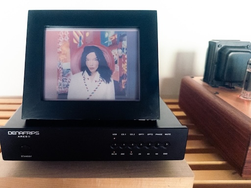

# BlackDog

---
E Ink Album Art Display for Raspberry Pi

Turn your RaspPi audio source, plus Inky Expression 7-color E Ink display, into a beautiful album art display for your hifi system.

Display your own images while the stereo is not being used.

## Features

- **Shairport Sync (Airplay)** support
- **MPD (Music Player Daemon)** support
- **Screen Saver** module
- **Gradient borders** when the album art does not fill the display
- Centered on Moode Audio but not dependent on it
- Modular implementation, easy to add support for any other audio rendere that provides album art metadata
- Minimal CPU/power utilization due to event-driven design

## Hardware Requirements

- Raspberry Pi
- Inky Expression 7-color E Ink display
- BYO DAC, amp and speakers, of course

## Install

- Install Moode Audio on your boot disk and configure to your liking

- Run the setup script:

```
sudo curl -L https://raw.githubusercontent.com/lansing/blackdog/refs/heads/master/setup.sh | bash
```

- Make sure your Inky Expression is plugged in to your GPIO pins

- Play some tunes and enjoy the album art

## More details


### BlackDog components

- **Display Server** provides an HTTP endpoint. Images posted here will be processed
(which includes adding a gradient border/background if requested) and rendered on the E Ink display
- Source modules
  - **Shairport Sync source**: subscribes to an MQTT topic for changes in album art metadata
  - **MPD source**: uses the native MPD client to listen for changes in the current track filename,
    fetches album art from an HTTP endpoint (such as one provided by Moode Audio)
  - **Screen Saver source**: rotates through images in a directory. 

These all run as separate processes and systemd services.


### Stuff taken care of by the setup script

- Mosquitto MQTT broker is installed 
- Shairport is configured to publish metadata updates to an MQTT topic
- Some required RaspPi firmware config changes are made, if necessary, to support the Inky display
- The BlackDog components are installed as systemd services, and started


## Contact

Please get in touch if you're using this!

